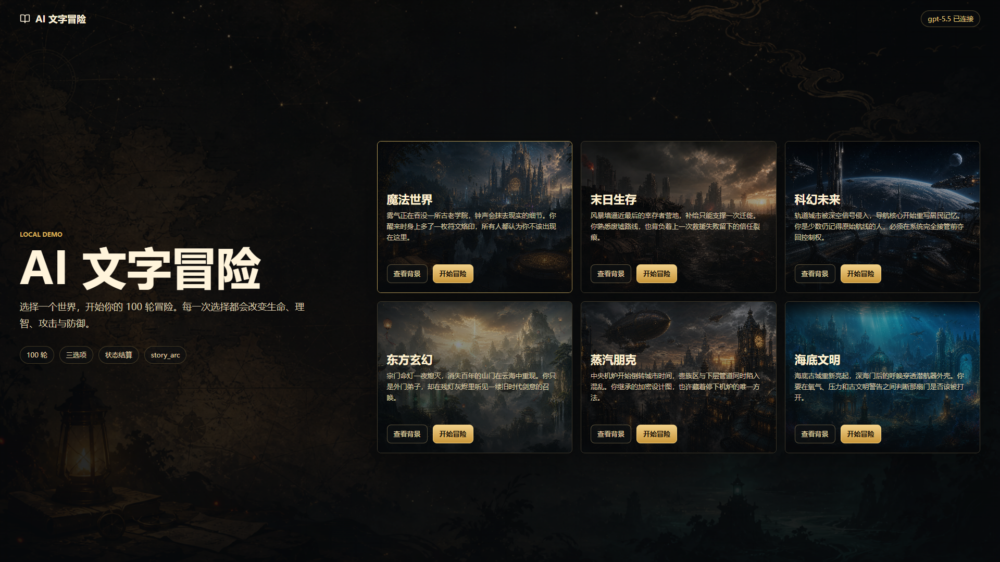
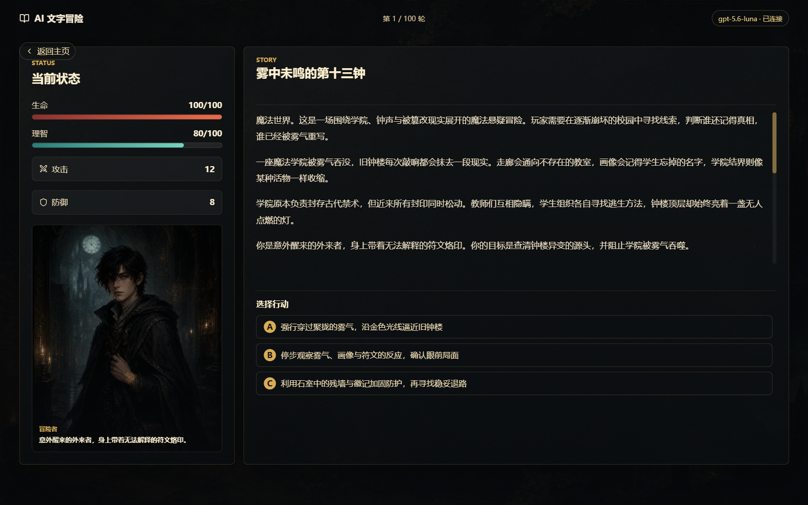

<p align="center">
  
</p>

<h1 align="center">AI Text Adventure</h1>

<p align="center"><strong>Enter another world. Let your choices write the story.</strong></p>
<p align="center">Six worlds · 100 rounds · Three choices each turn · AI narration + rule-driven outcomes</p>

<p align="center">
  <a href="./LICENSE"></a>
  <a href="https://github.com/tank7155611/ai-text-adventure/actions/workflows/ci.yml"></a>
  <a href="./package.json"></a>
  <a href="https://github.com/tank7155611/ai-text-adventure/stargazers"></a>
</p>

<p align="center"><a href="./README.md">简体中文</a> | <strong>English</strong></p>
<p align="center"><a href="#quick-start">Quick start</a> · <a href="#preview">Preview</a> · <a href="#design">How it works</a> · <a href="https://github.com/tank7155611/ai-text-adventure/issues">Feedback</a></p>

> A local demo. Bring your own OpenAI-compatible API key; model calls may incur charges.

---

<a id="preview"></a>

## A Glimpse of the Adventure



<sub>Captured from an earlier demo build. Interface details may differ from the current version.</sub>

### Inside the Adventure



The current Chinese interface during an actual run: character portrait and stats on the left, AI-generated narrative and three available actions on the right. Story text and choices vary between runs.

## What Makes It Different

| | Your adventure |
| --- | --- |
| 🌌 Six distinct worlds | Magic, apocalypse survival, sci-fi, xianxia, steampunk, and underwater civilization. |
| 🧭 Decisions with consequences | Three choices each round shape health, sanity, attack, defense, and story progress. |
| 📖 AI tells the story | The model writes narration and choice descriptions; the rules engine settles outcomes. |
| 🕯️ A story that remembers | Chapter records and story arcs track earlier choices and unresolved threads within a run. |
| ⚖️ Multiple endings | Reach a standard or perfect ending—or face a bittersweet outcome, collapse, or death. |

<a id="quick-start"></a>

## Running Locally

Requires Node.js 24 or later. Configure your own model provider; API calls may incur charges.

### 1. Install Dependencies

```bash
npm ci
```

### 2. Configure Environment Variables

Copy `.env.example` in the project root to `.env.local`, then enter your provider's URL, model name, and API key:

```env
VITE_OPENAI_COMPAT_BASE_URL=https://api.example.com/v1
VITE_OPENAI_COMPAT_MODEL=your_model_name
OPENAI_COMPAT_API_KEY=your_api_key_here
```

- `VITE_OPENAI_COMPAT_BASE_URL`: your OpenAI-compatible API base URL.
- `VITE_OPENAI_COMPAT_MODEL`: the model name.
- `OPENAI_COMPAT_API_KEY`: your API key, added to request headers by the local Vite proxy.

Do not commit `.env.local` or put real API keys in source code.

### 3. Start the Development Server

```bash
npm run dev
```

Open the local URL shown in the terminal, for example:

```text
http://127.0.0.1:5173/
```

### 4. Build

```bash
npm run build
```

### 5. Run Tests

Run the full test suite:

```bash
npm test
```

Watch for changes during development:

```bash
npm run test:watch
```

### 6. Preview the Build

```bash
npm run preview
```

### 7. Balance Simulation

Run deterministic simulations using the actual rules engine across six worlds, four strategies, 50 seeds, and two recovery thresholds. Each run checks that Chinese and English produce identical numerical trajectories:

```bash
npm run simulate:balance
```

The script runs 4,800 games, including 2,400 Chinese comparison runs. It reports average ending round, HP, SAN, progress, ending distribution, consecutive rounds without healing, wasted healing, and whether a survival option existed when a character died. Detailed results are written to `output/balance-review-results.json`. The simulation reads hidden plans, so its results do not represent real player win rates. It does not measure perfect endings because there are no model-generated clues. Conservative and balanced strategies do not use the variable recovery threshold, so their results are identical for both thresholds.

For additional setup instructions in Chinese, see [启动说明.md](./启动说明.md).

## Deployment and API Keys

This is a local demo. Deploying the current setup directly to the public internet is not recommended.

The local Vite proxy reads the API key and adds it to requests sent to the model provider. Frontend code does not read the key. Variables prefixed with `VITE_` are exposed to the frontend, so the secret must use `OPENAI_COMPAT_API_KEY` without a `VITE_` prefix.

Publishing the repository does not provide an online model service. Static hosting such as GitHub Pages cannot run the local proxy. A public deployment should use:

```text
Frontend
↓
Your backend API
↓
OpenAI-compatible model service
```

The current Vite proxy is intended for local development and demos. Keep it bound to the local machine; do not share a development server containing your personal key through public tunnels or exposed ports. A public backend also needs access controls and usage limits.

<a id="design"></a>

## Behind the Adventure

The AI writes the narrative; the frontend rules engine owns numerical outcomes. Expand the sections below for implementation details.

<details>
<summary>Game mechanics and reliability</summary>

## Features

- Six worlds: magic, apocalypse survival, science fiction, Eastern cultivation fantasy (xianxia), steampunk, and an underwater civilization.
- A 100-round adventure with three actions, A/B/C, each round.
- Story text is received in full, then progressively displayed in the interface.
- Opening and regular-round text plays at approximately 20 characters per second, with updates every 100 ms to avoid whole-second jumps.
- The frontend generates hidden `ChoicePlan` outcomes before presenting choices. Story prompts, next-round planning, and final settlement share the same settlement preview.
- During regular-round text playback, the game prepares the next set of plans. It only displays and enables the final choices after the control JSON is ready.
- Health recovery has an independent selection weight: bandaging, first aid, and full rest can appear in the preparation slot regardless of current HP. Normal, risky, and major actions have increasing health costs, with a cap on damage per action.
- Choice-control and JSON-repair requests each have a 45-second timeout. On timeout, the current story remains visible and the player can retry generating choices.
- Two-stage generation: narrative text first, followed by a short control JSON response.
- Zod validates the control JSON, with one automatic repair attempt on failure.
- The rules engine handles stat changes, hidden-state merging, ending selection, and settlement display.
- Progress is capped by the current round. After progress reaches 70, major breakthroughs yield one less progress point to maintain pressure in the final stages.
- The frontend determines the ending: death, collapse, incomplete, bittersweet, standard, or perfect. The model only writes the corresponding narrative.
- `story_arc` tracks the main objective, current story thread, unresolved foreshadowing, and ending direction to reduce long-term narrative drift.
- Attack, defense, and sanity participate in lightweight action-specific checks. Attack and defense continue to provide tiered damage reduction above their initial thresholds, while risky actions retain minimum damage.
- Each run has its own seed. Switching languages does not change the numerical route for the same seed.
- Major rounds at low sanity still provide three distinct plans. High stats increase the weight of specialized actions without excluding other routes.
- Explicit removal fields handle healed injuries and allies who die or leave. The main objective stays fixed, and chapter records retain early choices and important facts.
- The apocalypse world includes a continuing branch for rescuing residents, receiving medical support, and escorting survivors to safety later in the game.
- Quitting or restarting isolates stale requests. Story and finale requests time out after 90 seconds, and the connection indicator reflects actual request activity.

</details>

<details>
<summary>ChoicePlan and two-stage generation</summary>

## Core Design

The model operates within a game loop controlled by explicit rules.

```text
Player selects an action
↓
Frontend reads the action's ChoicePlan
↓
LLM generates the complete narrative; the interface plays it progressively
↓
LLM generates control JSON without streaming
↓
Zod validation / automatic repair
↓
Frontend rules engine calculates actual stat changes
↓
Display settlement and the next set of choices
```

### ChoicePlan

Before presenting an action, the frontend generates a hidden `ChoicePlan`:

```ts
type ChoicePlan = {
  risk_label: string;
  tone: 'calm' | 'gain' | 'loss' | 'tradeoff' | 'major_gain' | 'major_loss';
  stat_changes: Partial<PlayerStats>;
  progress: number;
  intent: string;
  settlement_hint: string;
  checks: ('attack' | 'defense' | 'sanity')[];
};
```

The AI turns these hidden plans into natural-language choices. It cannot change their numerical outcomes or main-story progress.

`ChoicePlan` is not a fixed A/B/C template. Based on the round, world, language, character state, and progress, the frontend samples three plans from an outcome pool, shuffles them into A/B/C, and asks the AI to write their descriptions.

Pursuit actions grant 2 progress points, and major extreme actions grant 4, with reduced costs for some major actions. Progress is constrained in two ways: each round has a maximum allowed progress value, and once progress reaches 70, major breakthroughs with `progress >= 3` yield one less point. Ordinary progress gains stay unchanged. Progress blocked by the round cap can convert into up to 2 points of defensive preparation. Settlement displays actual changes after stat caps are applied.

Low sanity affects the choice pool and danger checks. Panic, composure, loss-of-control, and sanity-restoration plans become more likely. Powerful sanity restoration is weighted more heavily as SAN falls, but is not guaranteed each round. Health recovery independently has a 35% weight in the ordinary preparation slot, regardless of current HP: bandaging (+18), first aid (+30), or full rest (+45). Apocalypse resident-branch events replace that slot. During combat, ambushes, escapes, traps, hazardous environments, reversals, or rituals, low sanity increases existing health losses; settlement explains why.

### Two-Stage Generation

Each round uses two requests:

1. Narrative generation: a non-streaming request retrieves the complete text, which the interface then displays progressively. This avoids making narrative streaming and choice-control requests wait on one another.
2. Control JSON generation: a non-streaming, low-temperature request produces a short response containing the event type, summary, hidden state, `story_arc`, and next-round choice text.

Finales use a shared `finale_v1` structure. The frontend calculates `ending_kind` from health, round number, progress, and sanity; the model cannot change the ending type.

This reduces truncated long-form JSON, invalid output formats, and model-generated changes to numerical outcomes.

</details>

<details>
<summary>Project structure and division of responsibilities</summary>

## Project Structure

```text
src/
  App.tsx
  main.tsx
  styles.css
  data/
    worlds.ts
  game/
    ai.ts
    prompts.ts
    rules.ts
    schemas.ts
    types.ts
  services/
    llmClient.ts
  utils/
    json.ts
public/
  assets/
    ui/
    worlds/
    protagonists/
```

Key modules:

- `src/game/prompts.ts`: prompt construction.
- `src/game/ai.ts`: LLM calls, narrative parsing, JSON validation, and repair.
- `src/game/rules.ts`: choice plans, stat settlement, hidden state, endings, and progress.
- `src/game/schemas.ts`: Zod schemas.
- `src/services/llmClient.ts`: OpenAI-compatible API requests.
- `src/data/worlds.ts`: world settings and asset configuration.

## How This Differs from a Typical AI Text Adventure

Many AI text adventures let the model determine the story, choices, and numerical outcomes together. This can lead to drifting stats, out-of-range values, contradictions, and formatting failures.

This project assigns distinct responsibilities:

- AI: narration, choice descriptions, summaries, and foreshadowing.
- Frontend rules engine: stats, state, endings, and main-story progress.
- Zod: validation of the control JSON structure.

This design supports longer, multi-round adventures that can be demonstrated consistently.

</details>

<details>
<summary>Resident branch and ending conditions</summary>

## Resident Branch and Endings

The apocalypse world offers rescue opportunities on rounds 10, 15, and 20. Rescued medical staff can provide healing when supplies are available, with a six-round cooldown. From round 70 onward, players have an opportunity to escort residents to safety every five rounds. Completion is recorded in the ending. The rules engine maintains this state; the model cannot declare the branch complete on its own.

A perfect ending requires at least one key clue, at most two unresolved foreshadowing threads, and sanity above 60. It normally requires 90 progress, reduced to 85 after successfully escorting residents. Other endings follow their progress and sanity thresholds, with death taking priority.

`removed_allies` and `healed_injuries` remove existing state entries by name; ordinary arrays still add new entries. Every ten rounds, a chapter record preserves choices, outcomes, and key facts. This chapter memory exists only in the current run's memory; it is not a save system.

</details>

## Tech Stack

- React 19
- TypeScript
- Vite 7
- Zod
- lucide-react
- OpenAI-compatible Chat Completions API

## Future Directions

- More worlds and protagonist artwork.
- Improved mobile layouts.
- Local saves or adventure-log exports.
- A backend proxy for secure public deployment.
- More detailed checks and world-specific rules.
- Additional automated tests for JSON repair and state settlement.

## License

Project code is available under the [MIT License](./LICENSE), allowing use, modification, and redistribution, including commercial use, provided the license notice is retained.

Images were generated by the project author using GPT. See [ASSETS.md](./ASSETS.md) for source and usage notes, and [THIRD_PARTY_NOTICES.md](./THIRD_PARTY_NOTICES.md) for dependency and icon notices. These supplementary documents are currently in Chinese, with third-party license texts preserved in their original language.
